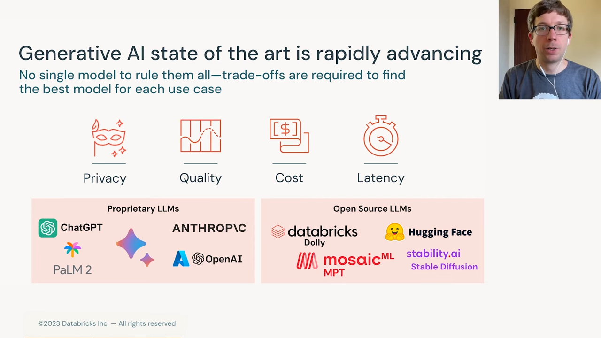
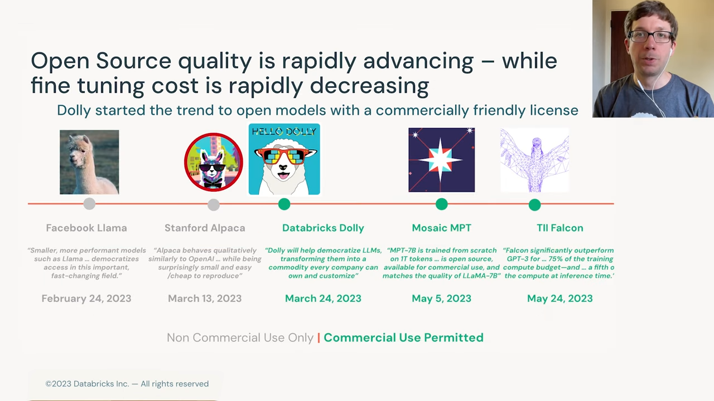
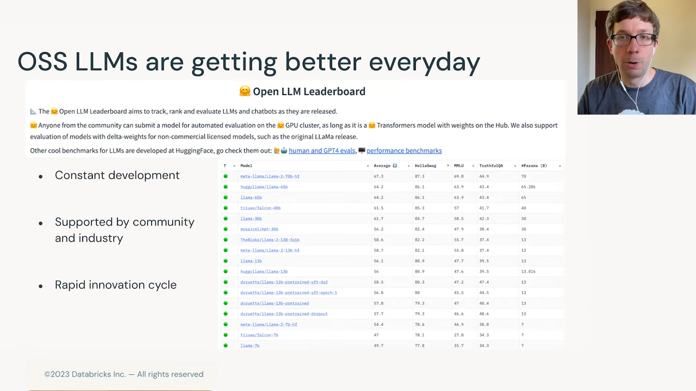
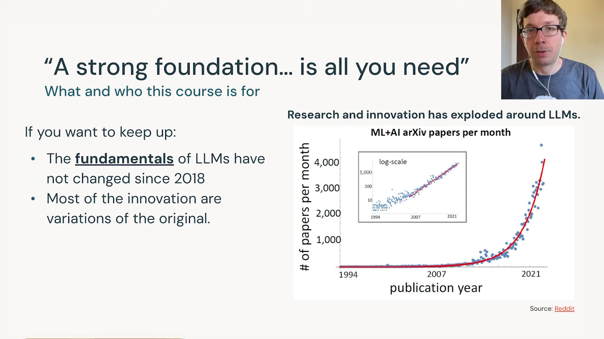

참고 사이트
- https://youtu.be/W0c7jQezTDw?list=PLTPXxbhUt-YWjMCDahwdVye8HW69p5NYS

---

- 이 코스를 만든 이유 설명
- 생성형 AI의 최첨단 기술이 빠르게 발전
- 특정 용도를 위한 맞춤형 모델 필요성 증가
- 단일 모델이 모든 용도에 이상적이지 않음
- 여러 회사에서 다양한 성공적인 독점 대규모 언어 모델 제공
- 연구자와 기업이 다양한 오픈 소스 LLM 개발
- 코스 목표: 모델 기본 이해와 고품질 응용 프로그램 및 모델 제작 지원

---

- 몇 년 전에는 소수만 고품질 LLM 제작 비밀을 알고 있었음
- 오늘날 오픈 소스로 자유롭게 사용할 수 있는 모델의 품질이 향상
- 모델 제작 방법에 대한 지식 확산
- 최근 오픈 소스 모델 역사 설명
- 처음에는 상업적으로 사용할 수 없는 모델 존재
- Meta가 2023년 초에 Llama 모델 발표
- 스탠포드 대학의 Alpaca 모델 개발
- 여러 그룹이 상업적으로 사용할 수 있는 모델 개발
- Databricks의 Dolly, Mosaic ML의 MPT, DII의 Falcon 모델 예시
- Facebook이 Llama 2 발표 (일정 크기 이하 기업이 상업적으로 사용 가능)

---

- LLM 평가를 위한 공통 방법 개발
- Hugging Face의 오픈 LLM 리더보드 예시
- 다양한 작업(파이썬 프로그래밍, 질문 답변 등)에 대한 모델 평가
- 커뮤니티가 모델 성능 이해 및 개선에 도움

---

- 코스는 LLM의 기본 이해에 중점
- 기본적인 내용을 이해하면 다양한 모델 간의 세부 차이를 알 필요 없음
- 2018년 첫 현대적 Transformer 모델 등장 이후 LLM 기본은 크게 변하지 않음
- 매달 수천 개의 기계 학습 연구 논문 발표
- 모두 읽을 필요는 없음
- 코스는 필수적인 주제와 실습 자료로 구성
