- 모듈 1에서는 트랜스포머와 어텐션 메커니즘을 다룸
- 대형 언어 모델은 큰 데이터와 많은 수의 파라미터로 인해 '대형'이라 불림
- 많은 개인과 조직이 처음부터 LLM을 훈련시키기 어려움
- 이에 따라 파라미터의 일부만 업데이트하는 방식인 파인튜닝이 사용됨

---
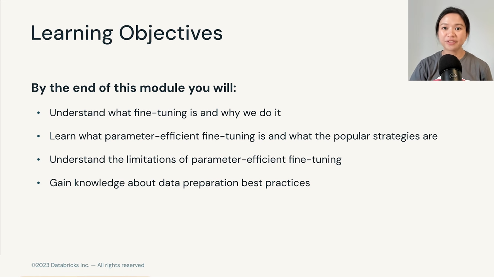

- 이 모듈에서는 파인튜닝의 정의와 이유를 설명
- 파라미터 효율적인 파인튜닝 방법과 그 한계를 다룸
- 데이터 준비의 모범 사례도 다룸

---

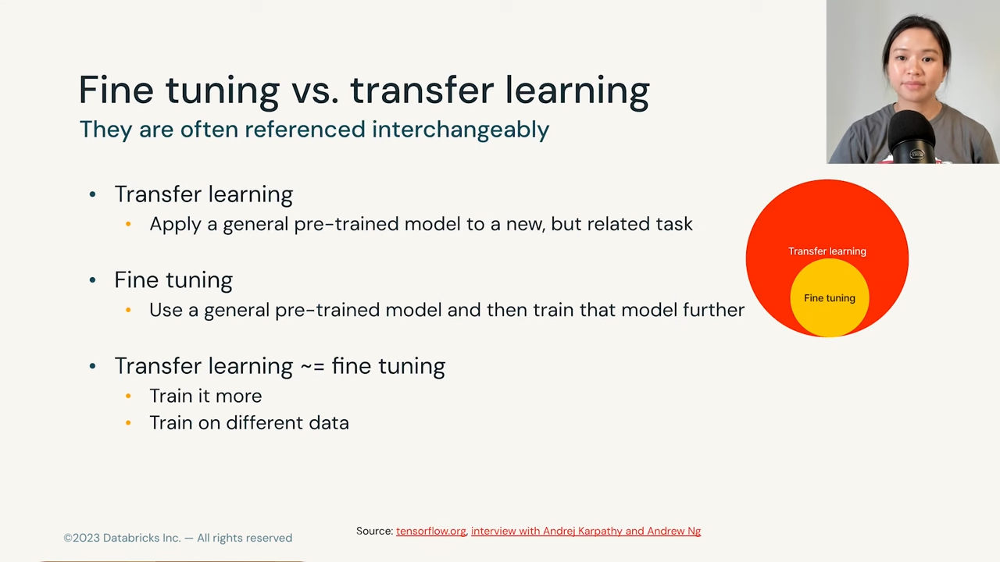

- 파인튜닝 정의: 전이 학습의 일종으로, 일반적인 사전 학습 모델을 새로운 관련 작업에 적용
- 스포츠 비유: 테니스를 할 줄 알면 배구를 더 쉽게 배울 수 있음
- 파인튜닝은 기본 모델을 더 훈련하거나 더 많은 데이터로 훈련하는 것을 의미

---

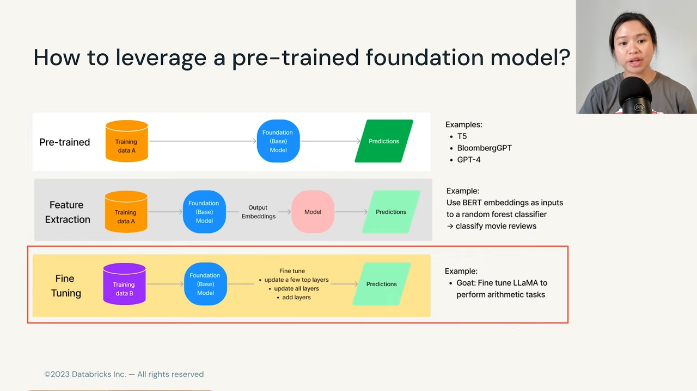

- 사전 학습 모델을 활용하는 세 가지 방법:
  - 사전 학습 모델 그대로 사용
  - 사전 학습 모델의 출력을 특징으로 사용
  - 파인튜닝

- 파인튜닝 예시: Llama를 연산 작업에 맞게 튜닝한 Goat 모델
- 파인튜닝 이유: 특정 작업에서 더 나은 성능을 원함
- 2018년에 제레미 하워드와 세바스찬 루더가 NLP 작업에 사용할 수 있는 파인튜닝 기술 발표

- 파인튜닝은 모델의 가중치나 파라미터를 업데이트하는 것

---

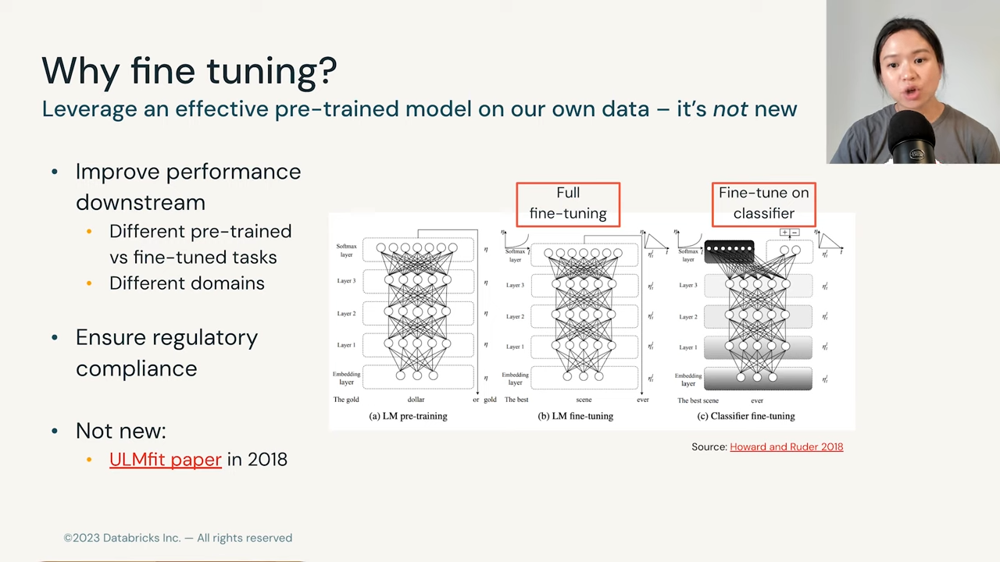

- 전체 파인튜닝은 모든 모델 가중치를 업데이트하고 작업별로 새로운 모델 생성
- 전체 파인튜닝의 단점: 많은 모델 복사본 필요, 디스크 공간 부족, 카타스트로픽 포게팅(이전 작업을 잊음)

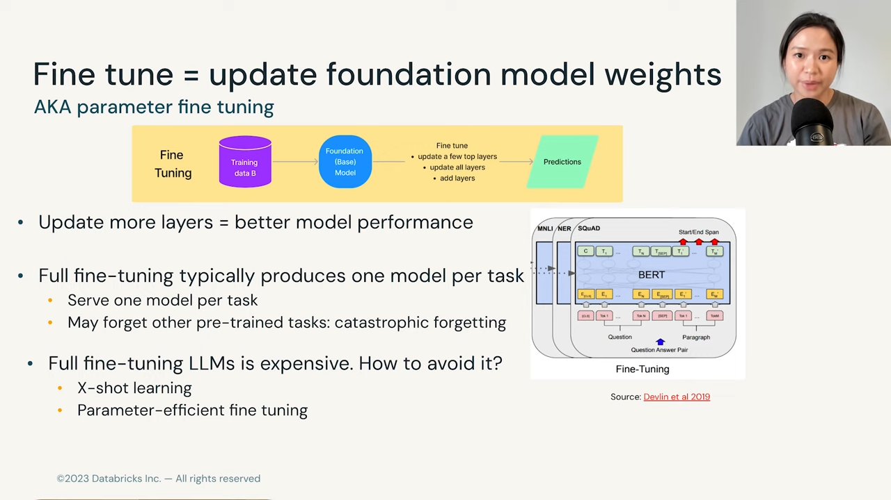

- 파인튜닝을 피하는 방법: 샷 학습과 파라미터 효율적인 파인튜닝
- 샷 학습: 텍스트 프롬프트로 몇 가지 예시 제공
- 샷 학습은 모델 가중치를 업데이트하지 않음

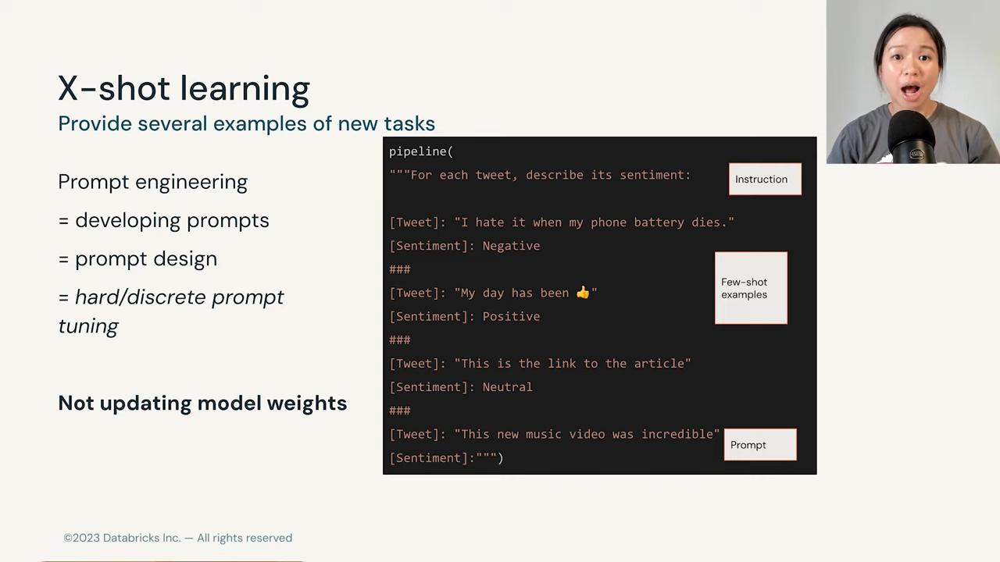

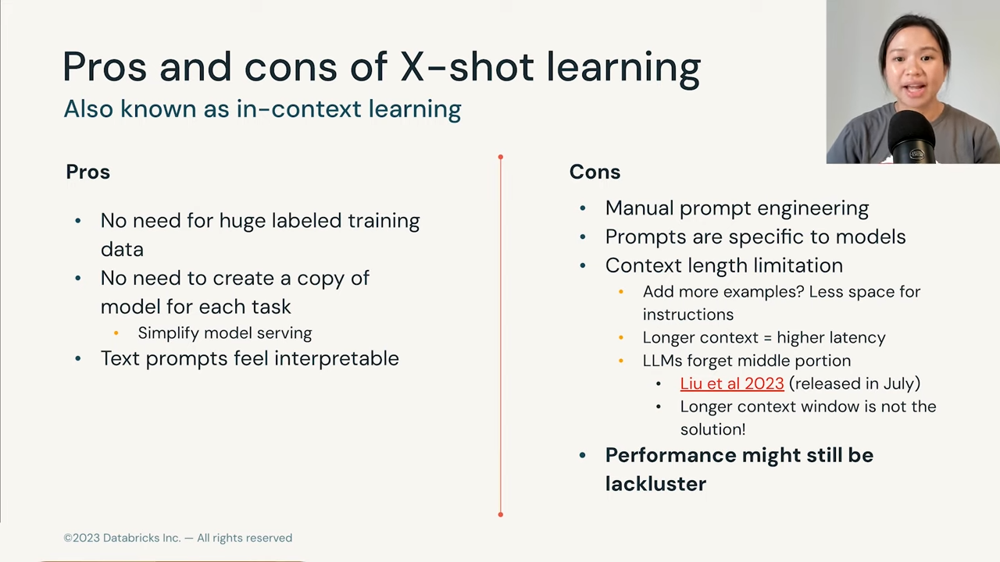

- 샷 학습 장점: 레이블된 훈련 데이터 필요 없음, 모델 복사본 생성 불필요
- 단점: 모든 것이 수동적이고 노동집약적, 프롬프트가 모델에 매우 특화됨
- 컨텍스트 길이 제한 문제 존재

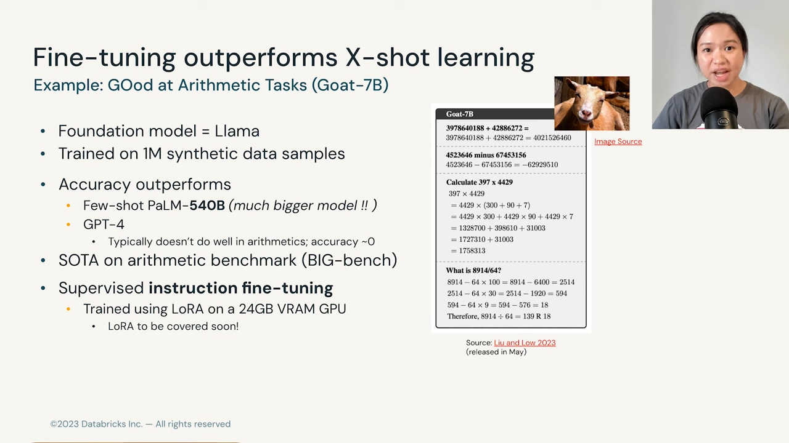

- 파인튜닝의 장점: 샷 학습보다 성능이 뛰어남
- Goat 7B 모델 예시: Llama 기반으로 1백만 개의 합성 데이터 예제로 훈련
- 샷 학습보다 더 나은 성능을 보임

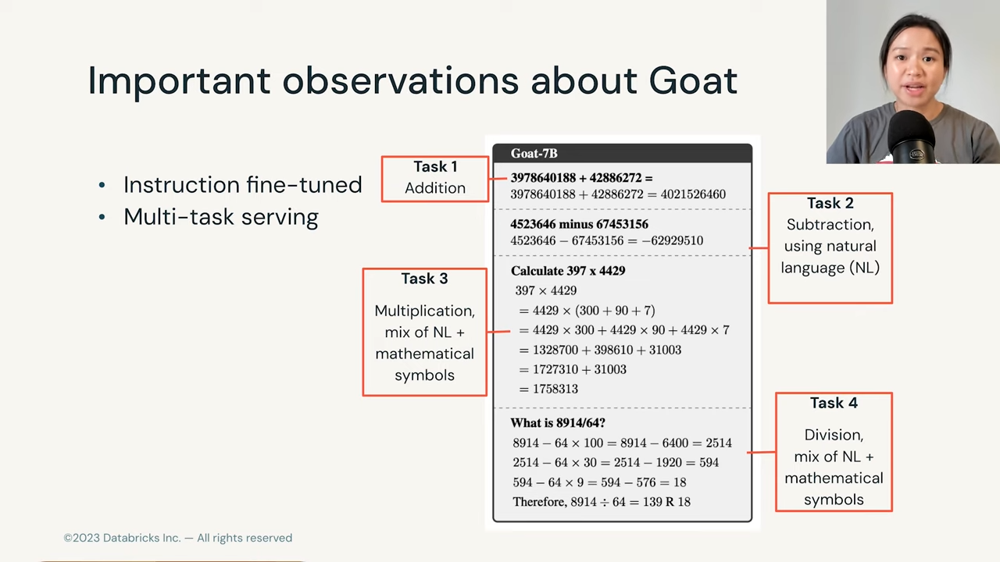

- 파인튜닝의 두 가지 중요한 점:
  - 명령어로 튜닝된 모델
  - 여러 작업을 수행할 수 있음
- Flan, Dolly 등의 다중 작업 NLP 모델 예시

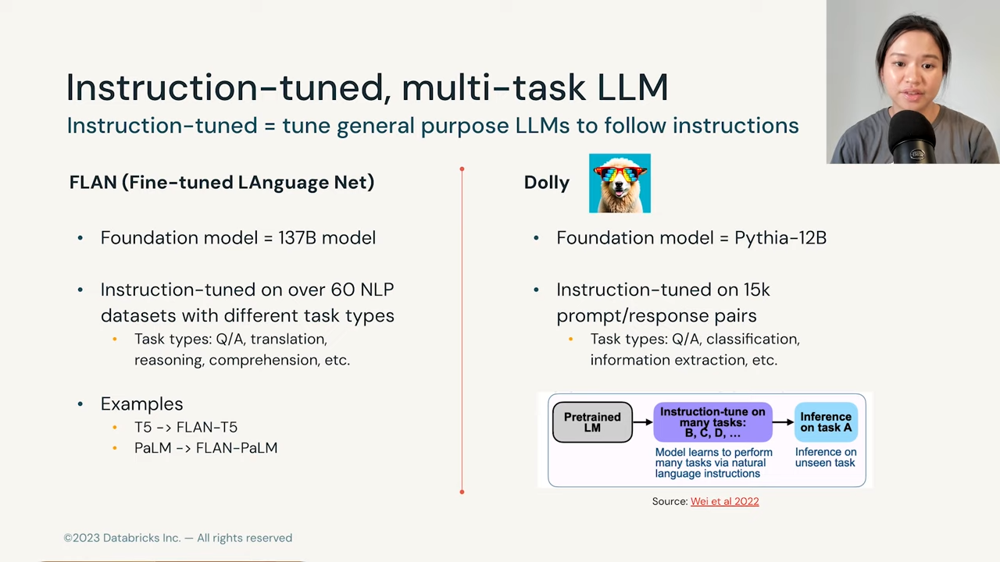

- Flan: 137억 개의 파라미터 모델, 60개 이상의 NLP 데이터 세트로 파인튜닝
- Dolly: Pythia 120억 파라미터 모델, 15,000개의 프롬프트와 응답 쌍으로 파인튜닝

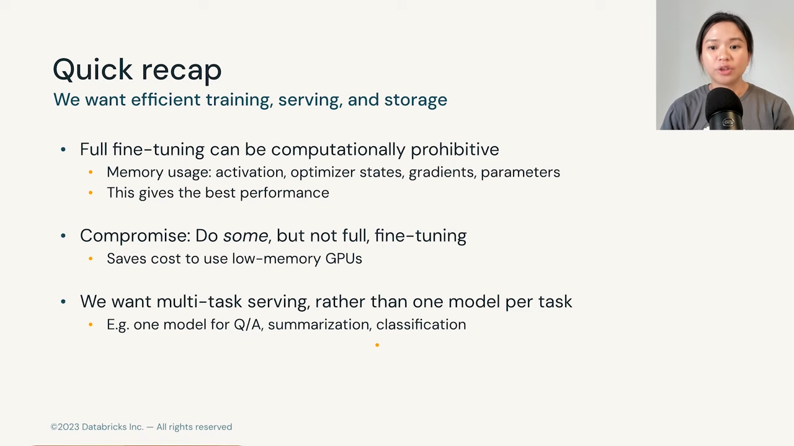

- 파인튜닝 모델의 목표:
  - 효율적인 훈련
  - 효율적인 서빙 및 저장
  - 멀티태스크 수행 가능
- 다음 섹션에서는 파라미터 효율적인 파인튜닝 기술을 다룰 예정