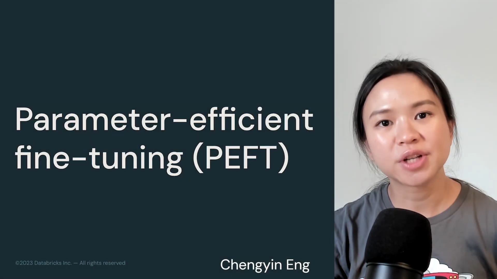
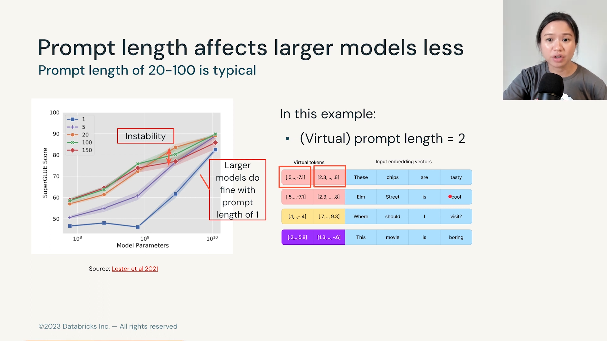

# PEFT and Soft Prompt

## 요약

## 키워드
- PEFT
- Hard Prompt, Discrete Prompt
- Soft Prompt
- Virtual token
- Prefix tuning

  
Prompt

  
  LLM 분야에서 "프롬프트(prompt)"는 사용자가 **언어 모델에 제공하는 입력 문장**을 의미합니다. 프롬프트는 모델이 특정 작업을 수행하도록 지시하는 역할을 합니다.

## 내용

- Parameter-efficient fine-tuning
- 파라미터 효율성은 저장, 메모리, 계산 및 성능 등의 여러 측면이 포함됨

---

- PEFT에는 Additive, Selective, Re-parameterization 등 세가지 범주가 있음
- 이 강의에서는 Selective 방법이 다른 2가지 방법 만큼 좋지 않다고 판단되어 제외

---

- PEFT는 매우 활발하게 연구되고 있는 분야임
- Additive 방법은 모델에 새로운 튜닝 가능한 레이어(임베딩 레이어 또는 모델 레이어 등)를 추가하는 것이 포함되며, 미세조정 과정에서는 이러한 새로운 레이어 가중치만 업데이트하고 기본 모델의 가중치는 동결된 상태로 유지함.
- Reparameterization은 가중치 행렬을 저차원 행렬로 분해하는 것을 포함
- 기본적으로 이러한 방법은 코어 트랜스포머 플록에서 작동하며 일부는 정보 전달을 담당하는 쿼리, 키, 값 행렬에서 작동함.

---

- 하드 프롬프트와 이산 프롬프트는 수동으로 텍스트 프롬프트를 작성하는 작업임
- 소프트 프롬프트는 프롬프트 엔지니어링의 수동적인 측면을 제거하였음
- 소프트 프롬프트는 입력에 가상 토큰을 추가하는 것
- 아래 그림에는 text input이 있음. 아래는 임베딩 벡터라 부름.
- “These chips are tasty”와 같은 텍스트 입력에 Virtual tokens을 추가하는 것이 소프트 프롬프트임.
- 이 가상 토큰은 작업에 맞게 추가된 것임.
- Soft Prompt는 Virtual tokens와 동의어임
- 소프트 프롬프트는 임베딩 벡터와 동일한 차원을 가짐.
- 학습 가능한 가상 토큰은 입력 임베딩 벡터와 연결함.
- 미세 조정 과정에서 이를 모델 튜닝이 아니라 프롬프트 튜닝이라 함.
- 여기서 분홍색으로 표시된 프롬프트 가중치만 업데이트하기 때문임.

---

- 프롬프트 엔지니어링의 어려운 부분은 매우 수동적이고 노동 집약적이며 오류가 발생하기 쉽다는 점임.
- 그래서 완벽한 프롬프트를 인간이 작성하는 대신, 소프트 프롬프트는 모델이 미세 조정을 통해 최고의 프롬프트를 찾도록 함.
- 처음에는 임의의 숫자로 구성된 임베딩 벡터를 무작위로 초기화함.
- 이 벡터는 입력 임베딩과 동일한 차원을 가짐.
- 무작위로 초기화된 임베딩 벡터는 완전히 임의적이므로 어떤 텍스트에 해당하는지 알 수 없음.
- 오른쪽 그림에서 실제 단어 입력 토큰이 있으면 임베딩 공간에서 시각화할 수 있고 어떤 단어를 나타내는지 알 수 있지만, 가상 토큰의 경우 임베딩 공간의 어딘가에 존재하지만 어떤 텍스트에 해당하는지 알 수 없음
- 이는 마치 비트코인과 같아서 돈처럼 기능하지만 현금처럼 만질 수 없고 어떻게 생겼는지도 모르지만 존재하고 작동하는 것과 같음
- 일부 연구에서는 이 가상 토큰을 이산 프롬프트를 나타내도록 초기화하는 경우도 있음. 이는 모델이 미세 조정 과정에서 임베딩 벡터를 업데이트할 수 있도록 최소한의 이산 프롬프트를 제공하는 것을 의미함. 예를 등어, 내 이산 프롬프트가 “이 문장을 분류하세요” 또는 ”이 문장을 번역하세요”와 같은 간단한 세 단어 프롬프트일 수 있음. 그런 이산 프롬프트는 미세 조정 과정에서 자유롭게 업데이트될 수 있음.
- 이를 이산 프롬프트 초기화하고 함. 하지만 흥미로운 점은 무작위 초기화가 특정 텍스트 입력 대신 임의의 숫자로 프롬프트를 설정할 때도 거의 동일하게 좋은 성능을 보인다는 점임. 따라서 이후 노트북에서 무작위 초기화와 이산 프롬프트 초기화를 모두 다뤄보며 이러한 개념을 구체적으로 이해해볼 것임.

---

- 프롬프트 튜닝과 full fine-tuning 비교
- 감정 분류 시나리오
- 이제 단일 입력 대신 여러 입력을 사용함. 작업 배치는 4로 정의.
- 감정을 총 네 가지로 분류하기 때문.
- 가상 토큰은 단순히 임의의 숫자이므로 특정 어휘나 텍스트와 일치하지 않음.
- Full fine-tuning할 때는 손실을 통해 모델 가중치를 100프로 업데이트 함.
- 기본 모델은 동결되지 않음.

---

- 프롬프트 튜닝에서는 기본 모델 가중치가 완전히 동결됨.
- 모델이 순전파와 역전파를 수행할 때 가상 토큰 가중치만 업데이트됨
- 이 가상 토큰은 역전파를 통해 학습되고 튜닝되어 제공된 레이블 프롬프트의 신호를 통합함.
- 그리고 가상 임베딩 벡터에만 그래디언트 업데이트를 적용함.
- 요약하면, 수동 프롬프트 엔지니어링이나 이산 프롬프트 작성은 few-shot 학습 예제에서처럼 컨텍스트로 예제를 제공하는 것과 유사함.
- 하지만 프롬프트 튜닝은 임베딩 공간에서 최고의 프롬프트 표현을 찾기 위해 검색하는 것임.
- 그리고 가장 좋은 점은 모델이 자동으로 최적의 프롬프트 표현을 학습한다는 점임.
- 따라서 이산 프롬프트를 수동으로 작성하는 노동이 제거됨.

---

- 이제 단일 예제만 포함하는 것이 아니라 Q&A, 번역 등 여러 작업이 포함된 예제도 생각해 볼 수 있음.
- 각 작업을 프롬프트로 간주할 수 있음.
- 각 작업마다 다른 소프트 프롬프트를 지정하면 됨.
- 배포 시 기본 모델을 교체할 필요없이 학습된 가상 토큰만 교체하면 됨.
- 또한 여러 작업을 동시에 처리할 수 있음.
- 다양한 작업이 포함된 배치를 혼합 작업 배치라고 함. (Mixed task batch)

---

- 연구자들은 110억 개 이상의 파라미터 규모에서 프롬프트 튜닝이 full fine-tuning과 성능이 비슷하다는 것을 발견
- SuperGLUE 점수는 다양한 작업을 포함하는 벤치마크로, 점수가 높을수록 좋음.
- 소프트 프롬프트 튜닝은 작은 모델에서는 성능이 좋지 않지만, 큰 모델에서는 full fine-tuning과 성능이 비슷함.

---

- 또한 프롬프트 길이도 큰 모델에서는 성능에 큰 영향을 미치지 않음.
- 예를 들어, 여기서 가상 프롬프트를 초기화할 때 2개의 임베딩 벡터만 있음.
- 이는 프롬프트 길이가 2인 것임.
- 큰 모델에서는 프롬프트 길이가 1인 경우에도 성능이 좋음.
- 프롬프트 길이가 100인 경우가 성능의 최적점임.
- 하지만 SuperGLUE 점수의 신뢰도 막대도 꽤 넓음.
- 따라서 소프트 프롬프트 튜닝은 성능이 불안정할 수 있음.

---

- 프롬프트 튜닝의 장점을 요약하면, few-shot 학습에서는 수동으로 프롬프트를 작성해야 하지만프롬프트 튜닝에서는 모델이 작업 특화 가상 프롬프트의 최적 임베딩 표현을 자동으로 학습함
- 여러 모델을 복사할 필요가 없으며 다중 작업 서비스가 가능함.
- 도메인 변화에도 강함
- 기본 모델 가중치를 동결하여 모델이 일반 언어 이해를 변경하지 않도록 방지함.
- 따라서 과적합 위험이 줄어듬. 학습된 소프트 프롬프트는 파라미터 수가 작아 다양한 작업에 일반화될 수 있음.

---

- 프롬프트 튜닝의 단점은 가상 토큰이 어떤 것인지 알 수 없다는 점임.
- 이를 추정하려면 코사인 거리와 같은 거리 척도를 사용해야 함.
- 두 번째 단점은 성능이 불안정할 수 있다는 점임.

---

- 소프트 프롬프트의 또 다른 방법으로 prefix tuning이 있음
- 프리픽스 튜닝은 프롬프트 튜닝과 유사하지만 입력 임베딩 레이어가 아니라 각 트랜스포머 블록에 프리픽스 레이어를 추가함
