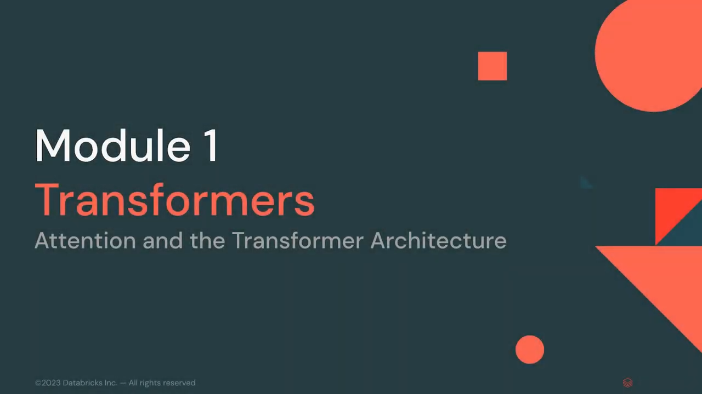

물론, 주어진 유튜브 비디오의 내용을 요약해 드리겠습니다.

### 요약:
- **강의 주제:** 이 강의 모듈은 트랜스포머(Transformers)에 관한 것입니다. 트랜스포머는 현재 거의 모든 대형 언어 모델에서 사용되는 주요 신경망 아키텍처입니다.
- **트랜스포머의 역사:** 2017년에 BERT 논문으로 처음 발표되었으며, 이후 대부분의 대형 언어 모델은 트랜스포머의 변형입니다. 예를 들어, OpenAI의 GPT 모델도 트랜스포머 기반입니다.
- **트랜스포머의 중요성:** 트랜스포머가 등장하기 전에는 다양한 심층 학습 모델 설계가 빠르게 실험되었지만, 트랜스포머 이후에는 대부분의 자연어 처리 모델이 동일한 기본 빌딩 블록을 따릅니다.
- **트랜스포머의 특징:** 트랜스포머는 입력의 다양한 측면 간의 상호작용을 학습할 수 있게 하며, 깊이에 따라 다양한 품질의 모델을 생성할 수 있습니다.
- **변형 및 개선:** 오늘날에도 특정 기능을 더 빠르게 하거나 비용을 절감하는 변형이 있지만, 기본 빌딩 블록은 동일합니다.
- **이해의 중요성:** 이 아키텍처를 자세히 이해하고 모델의 동작을 해석하며 새로운 변화를 평가할 수 있는 것이 중요합니다.